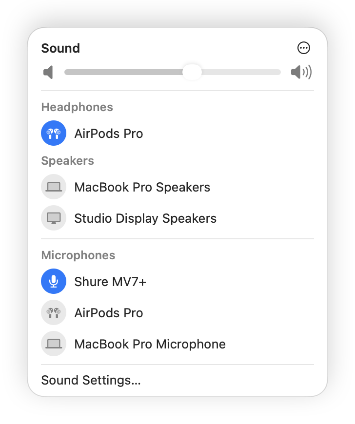

<p align="center">
  
</p>

<h1 align="center">SoundPin</h1>

<p align="center">
  <b>Keep your Mac on the microphone and speakers you chose — no more AirPods hijacking your input.</b><br>
  A smart audio device priority manager for the macOS menu bar.
</p>

<p align="center">
  <a href="https://github.com/realruian/SoundPin/releases/latest"></a>
  
  
  
  
</p>

<p align="center">
  <a href="README.md">简体中文</a> · <b>English</b>
</p>

<p align="center">
  
</p>

---

## 💡 Why SoundPin?

macOS does not have a native "pin device" or "audio priority" setting. If you use external audio gear, you've almost certainly run into these daily frustrations:

- 🎙️ **Microphone Hijacking**: You have a studio-grade USB/XLR microphone set up on your desk. The second you pop in your AirPods for listening, macOS ruthlessly switches your microphone to the AirPods — instantly degrading your voice into hollow, low-bandwidth Bluetooth phone quality.
- 🔇 **External Monitor Takeover**: Plugging into an external monitor (HDMI/DisplayPort) or a Thunderbolt dock often causes macOS to direct all audio output to built-in monitor speakers that might not even produce sound.
- 🔄 **Constant Manual Reverting**: macOS lacks memory for audio preference fallbacks. Every time you connect or disconnect a device, you find yourself digging through Control Center to fix it.

**SoundPin** solves this permanently. It maintains ranked priority queues for **Speakers, Headphones, and Microphones**. Whenever a higher-priority device is connected, the app ensures it is selected — and if macOS or another application tries to switch away, SoundPin switches it right back within milliseconds.

---

## ✨ Features

- 🎯 **Priority-Based Auto-Switching**: Automatically routes audio to the highest-ranked available device. If the system or another app tampers with the default device, it is restored immediately.
- 🎧 **Smart Headphone & Speaker Separation**:
  - Connect headphones: audio routes to headphones smoothly.
  - Disconnect headphones: audio cleanly reverts to your top-ranked desktop speakers.
  - Monitors (HDMI/DisplayPort) are intelligently identified via hardware transport types and **never mistaken for headphones**.
- 👆 **Click-to-Promote**: Clicking any active device in the menu bar panel immediately selects it and **promotes it to #1 priority** in its group.
- 🎨 **macOS Native Aesthetics**: Designed to seamlessly match the macOS Control Center Sound panel, complete with dynamic menu bar icons indicating volume levels, mute status, and the current headphone model.
- 🛡️ **Privacy-First & Lightweight**:
  - **Zero Audio Permissions**: No microphone recording access required or requested.
  - **Zero Network Activity**: No analytics, telemetry, or remote calls whatsoever.
  - **Zero Polling Overhead**: Purely event-driven via low-level CoreAudio listeners.
- 🌐 **Bilingual Support**: Built-in English and Simplified Chinese, following the macOS system language by default or customizable via settings.

---

## 🚀 Installation

Compatible with all Apple Silicon Macs (M1 through M4 series) and Intel Macs running macOS 13 or later.

### Option 1: Direct Download (Recommended)

1. Download the latest `.dmg` from [Releases](https://github.com/realruian/SoundPin/releases/latest).
2. Open the disk image and drag `SoundPin` into your **Applications** folder.
3. Launch the app. If macOS displays an unverified developer prompt on the first launch (since this open-source build is not notarized with an Apple Developer account), head to **System Settings > Privacy & Security** and click **Open Anyway**.

> 💡 Alternatively, you can strip the Gatekeeper quarantine attribute via Terminal:
> ```bash
> xattr -dr com.apple.quarantine /Applications/SoundPin.app
> ```

> 🔁 **Upgrading from 2.1 or earlier**: the app was called Audio Priority Bar then (renamed in 2.2). After installing, delete the old `AudioPriorityBar` from Applications. Your device order and settings carry over, and Open at Login has to be turned on again in the new app.

### Option 2: Build from Source

Requires the Xcode Command Line Tools:

```bash
git clone https://github.com/realruian/SoundPin.git
cd SoundPin
./install.sh
```

`install.sh` will compile a universal binary, install it to `/Applications/SoundPin.app`, and launch it.

---

## 📖 Usage & Pro Tips

SoundPin runs cleanly in the menu bar as a speaker icon:

| Action | Result |
|---|---|
| **Click a device** | Selects it and **promotes it to top priority** in its category |
| **Drag a device** | Reorders priorities (top has highest precedence) |
| **Device ⋯ menu** | Mark as "Never Select Automatically", "Ignore", or move between Headphones/Speakers |
| **Panel Header ⋯ menu** | Toggle auto-switching, open at login, edit device list, switch language, or quit |
| **Edit Device List** | Reveals offline/cached devices to organize priorities or remove obsolete entries |
| **Sound Settings…** | Quick shortcut to the macOS Sound system settings |

> ⏸️ **Pausing Auto-Switch**: If you temporarily want full manual control, disable "Switch Devices Automatically" in the `⋯` menu. An orange pill will appear next to the title — click it anytime to resume.

---

## ⚙️ How It Works

1. **Hardware Monitoring**: Directly leverages CoreAudio C APIs (`AudioObjectAddPropertyListenerBlock`) to track hardware registry changes, device plug/unplug events, and default device updates in real time.
2. **Persistent UID Mapping**: Device priorities are stored against their hardware UIDs in the user defaults (`io.github.realruian.SoundPin`), persisting across restarts and disconnects.
3. **Smart Heuristics**: Analyzes each device's `kAudioDevicePropertyTransportType` (USB, Bluetooth, HDMI, DisplayPort, Built-in) alongside a comprehensive brand keyword database to differentiate between headphones and speakers.

Inspect local preferences via Terminal:
```bash
defaults read io.github.realruian.SoundPin
```

---

## ⚠️ Known Limitations

- **Niche Bluetooth Earbuds**: If an uncommon earbud brand is missing from the built-in acoustic keyword database, it might initially fall into the speakers list. Simply hover its `⋯` menu and click "Move to Headphones" once; your choice will be saved permanently.
- **AirPlay**: AirPlay destinations that are not currently active will not appear in the list.
- **Bluetooth Pairing**: This app manages routing among devices already connected to your Mac and does not initiate Bluetooth discovery or connection.

---

## 🗑️ Uninstall

Quit the application from the `⋯` menu, then run:

```bash
rm -rf /Applications/SoundPin.app
defaults delete io.github.realruian.SoundPin
```

---

## 🛠️ Development & Tooling

The repository provides offline development and packaging tools:

- `tools/render-preview.sh [output.png] [--demo] [--lang en|zh-Hans]`: Renders high-resolution panel previews offline using SwiftUI view hosting without needing physical devices plugged in.
- `tools/check-devices.sh`: Verifies grouping and icon mapping logic across common audio device signatures.
- `tools/make-dmg.sh`: Generates a signed universal release DMG inside `dist/`.

---

## 🤝 Credits & Acknowledgments

This project is an enhanced fork of [tobi/AudioPriorityBar](https://github.com/tobi/AudioPriorityBar). Special thanks to tobi for the original priority switching concept and CoreAudio design. Versions up to 2.1 kept the original name, Audio Priority Bar; from 2.2 the app is called SoundPin (定音 in Chinese).

**Key enhancements in this fork**:
- 🎨 **Complete UI Redesign**: Re-engineered from scratch to mirror the modern macOS Control Center Sound panel.
- 👆 **Interactive Promotion**: Clicking an active device now directly switches to it and promotes it to #1 priority (the original ignored clicks while in auto mode).
- 🌐 **Localization**: Added full bilingual support (English & Simplified Chinese) with automatic system language detection.
- 🎧 **Dynamic Status Bar Icon**: Menu bar icon dynamically tracks volume tiers, mute status, and specific connected headphone models.
- 🖥️ **Anti-False-Positive Filtering**: Integrated transport-type filters so HDMI/DisplayPort audio outputs are never incorrectly classified as headphones.
- 🧩 **OS Compatibility**: Resolved panel collapse and layout rendering glitches on modern macOS releases.

---

## 📄 License

Distributed under the [MIT License](LICENSE).
