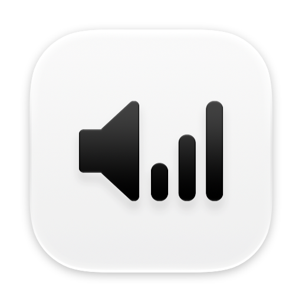
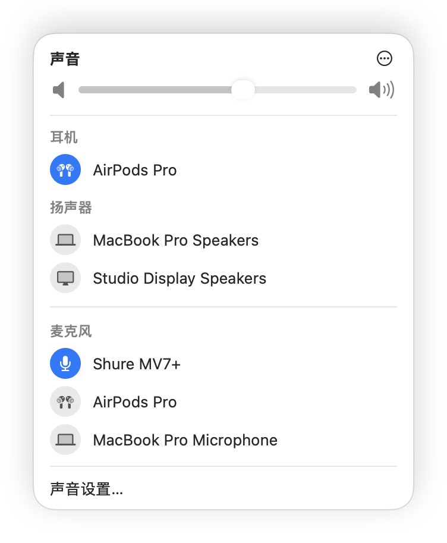

<p align="center">
  
</p>

<h1 align="center">Audio Priority Bar</h1>

<p align="center">
  让 Mac 始终使用你指定的麦克风和扬声器，不再被 AirPods 抢走输入。
</p>

<p align="center">
  
  
  
</p>

<p align="center">
  简体中文 · <a href="README.en.md">English</a>
</p>

<p align="center">
  
</p>

## 为什么需要它

macOS 没有"固定输入设备"的设置。AirPods 一连上，系统就会把麦克风切到 AirPods，哪怕你桌上插着一支更好的 USB 麦克风。显示器、扩展坞接上时，声音输出也会被带走。

Audio Priority Bar 给扬声器、耳机、麦克风各排一个优先级，始终使用已连接设备里排在最前面的那个。设备被系统或别的 App 切走，它会立刻切回来。

## 功能

- **按优先级自动切换**：设备连接或断开时，自动改用排名最高的已连接设备。
- **被切走会切回来**：系统或其他 App 改了默认设备，会被立刻改回。
- **耳机和扬声器分开排**：耳机连上自动用耳机，断开后回到排名最高的扬声器。
- **系统风格的面板**：样式照着 macOS 自带的"声音"菜单做，设备图标按型号显示。
- **菜单栏图标跟随状态**：静音、音量大小、正在使用的耳机，一眼能看出来。
- **只在本机运行**：不联网，不录音，不申请麦克风权限，没有统计上报。
- **中文界面**

## 安装

目前没有预编译的安装包，需要从源码构建。

**环境要求**

- macOS 13 或更高版本（在 macOS 27 上开发和测试）
- Xcode

**步骤**

```bash
git clone https://github.com/realruian/AudioPriorityBar.git
cd AudioPriorityBar
./install.sh
```

`install.sh` 会编译并安装到 `/Applications/AudioPriorityBar.app`，然后启动。以后更新代码，重新运行它即可。

App 没有窗口，也不在程序坞里，只有菜单栏上的一个喇叭图标。

## 使用

第一次使用时，点开菜单栏图标，把你想固定使用的设备排到各组第一位，再在右上角的 ⋯ 菜单里打开"开机启动"。

| 操作 | 效果 |
|---|---|
| 点一个设备 | 选中它，并把它排到该组第一位 |
| 拖动设备 | 调整优先级顺序 |
| 鼠标移到设备上，点右侧的 ⋯ | 忽略这个设备、永不自动选用、移到耳机或扬声器组 |
| 标题右侧的 ⋯ 菜单 | 开关自动切换、开机启动、编辑设备列表、退出 |
| 编辑设备列表 | 显示没连接的设备，方便提前排好顺序或删除旧设备 |
| 声音设置… | 打开系统的声音设置 |

关闭"自动切换设备"后，App 不再干预，标题旁会出现橙色的"自动切换已暂停"提示，点它可以恢复。

## 工作原理

- **发现设备**：通过 CoreAudio 列出音频设备，并监听设备增减和默认设备变化。
- **保存顺序**：优先级按设备 UID 存在本机的偏好设置里，设备重新连接后仍然有效。
- **自动切换**：每次设备变化，都把默认输入和输出设为排名最高的已连接设备。
- **分组**：输出设备分为扬声器和耳机两组，各有一个顺序。耳机靠设备名里的品牌关键词识别，也可以手动调整。

设置保存在 `app.audioprioritybar` 这个偏好设置域里，可以这样查看：

```bash
defaults read app.audioprioritybar
```

## 已知限制

- **小众品牌的蓝牙耳机**：不在识别名单里的耳机会被分到扬声器组，连上后不会自动切过去。在面板里点它一次即可。
- **隔空播放**：没有连接的隔空播放设备不会出现在列表里。
- **不能连接设备**：只管理已经连到 Mac 的设备，不能替你连接蓝牙耳机。
- **没有的功能**：静音开关、AirPods 降噪模式切换。这些请用系统的控制中心。

## 卸载

在面板的 ⋯ 菜单里退出 App，然后删除应用和它的设置：

```bash
rm -rf /Applications/AudioPriorityBar.app
defaults delete app.audioprioritybar
```

## 开发

菜单栏面板没法从外部截图，所以仓库里带了两个检查工具：

- `tools/render-preview.sh [输出.png] [--manual-look] [--edit-look] [--demo]`：把面板离线渲染成图片。不会改动音频设备。
- `tools/check-devices.sh`：打印一组样例设备分别落在哪个组、用哪个图标。

## 致谢

本项目基于 [tobi/AudioPriorityBar](https://github.com/tobi/AudioPriorityBar)，优先级切换的核心逻辑来自原作者 tobi。在原版基础上的改动：

- 面板按 macOS 系统"声音"菜单的样式重做
- 界面文字改为中文
- 点击设备会选中并置顶（原版在自动模式下点击无反应）
- 菜单栏图标跟随静音、音量和耳机状态
- 修复设备列表在 macOS 27 的菜单栏面板里不显示的问题
- 按设备型号和连接方式选择图标
- 走 HDMI 或 DisplayPort 的设备不再被误判为耳机

## 许可

[MIT](LICENSE)
